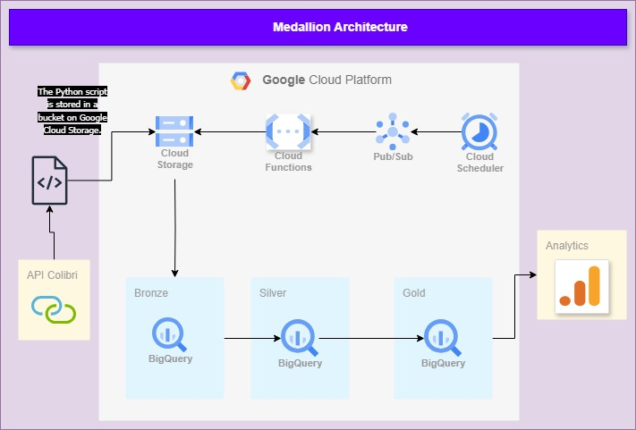

### Automating Data Pipelines with GCP: From Data Extraction to Strategic Insights

## 🧐️ The Problem:
Small businesses face the challenge of centralizing data from various sources and analyzing it. This demands an affordable solution since they cannot bear high infrastructure costs, and an accessible one because they cannot allocate a dedicated technical team for this.

## 💡  The Solution:

My application is a data pipeline system that automates the collection, processing, and analysis of restaurant data. It uses Google Cloud Platform (GCP) to implement a data lakehouse architecture, utilizing Python and SQL scripts, Google Functions, and Scheduler. The data is stored in layers of the medallion architecture in BigQuery for further analysis. Power BI is used to create interactive dashboards and reports that provide strategic insights for decision-making.

## ⚙️ How It Works:
Data Extraction and Processing: A Python program collects, transforms, and cleans the data via API. This program is deployed in Google Cloud Functions.

3. **Scheduling**: Google Cloud Scheduler and Pub/Sub automate the execution of the Python program in Functions, ensuring tasks run at specified times.
4. **Data Storage**: Processed data is stored in BigQuery, structured in bronze, silver, and gold layers for efficient management.
5. **Data Analysis**: The data can be accessed and analyzed in Power BI, enabling insightful business decisions.

## ⬆️ How to Deploy:

For a detailed step-by-step guide on how to deploy this pipeline, please refer to [my article on Medium](https://medium.com/@carolfazani/criando-um-pipeline-de-dados-com-google-cloud-functions-b527934dcba3). 

To learn how to create layers in BigQuery, read [this article](https://medium.com/@carolfazani/implementando-a-arquitetura-medalhão-no-big-query-cc6f952bca74).

For guidance on how to securely store passwords in Secret Manager, check out [this article](https://medium.com/@carolfazani/implementação-segura-de-senhas-um-tutorial-prático-56b8aa981beb).

To understand how to read data from the Colibri API, refer to [this article](https://medium.com/@carolfazani/extraindo-dados-de-restaurantes-com-python-e-a-api-do-colibri-8d3b442a30e6).

If you need to review specific parts of the code, I’ve documented them separately. You can find the documentation here:

- #### 📝 Index
    - [Database Configuration](https://github.com/carolfazani/Restaurant-Data/tree/master/database)
    - [Data Collection](https://github.com/carolfazani/Restaurant-Data/tree/master/extraction_colibri)
    - [Data Cleaning and Transformation](https://github.com/carolfazani/Restaurant-Data/tree/master/transform_data)
    - [Data Preparation for Analysis](https://github.com/carolfazani/Restaurant-Data/tree/master/BQ_model_data)
    - [Table Creation](https://github.com/carolfazani/Restaurant-Data/tree/master/BQ_create_tables)
    - [Loading Data](https://github.com/carolfazani/Restaurant-Data/tree/master/BQ_data_loading)

## Final Considerations

Thank you very much for your attention. If you'd like to adapt this for your own project, feel free to do so. To get started, you can fork the repository by clicking the "Fork" button at the top right of the GitHub page. If you found this useful, please consider giving it a star on GitHub!